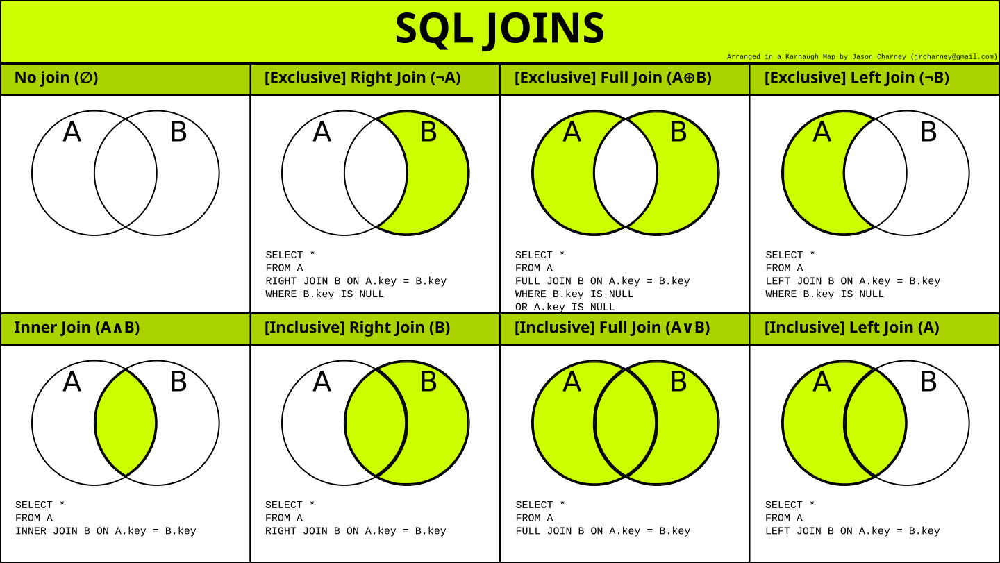

# **Tipos de JOIN no SQL com Diagramas de Venn**

As cláusulas **`JOIN`** em SQL são usadas para combinar dados de duas ou mais tabelas com base em uma relação existente entre elas, como chaves primárias e estrangeiras. O SQL ANSI define cinco tipos principais de JOIN: **`INNER JOIN`**, **`LEFT OUTER JOIN`**, **`RIGHT OUTER JOIN`**, **`FULL OUTER JOIN`** e **`CROSS JOIN`**.



---

## **Tipos de JOIN**

1. **`INNER JOIN`**: Retorna a interseção dos dados presentes nas duas tabelas (equivalente ao conceito de **`A ∩ B`** no diagrama de Venn).
   
2. **`LEFT OUTER JOIN`**: Retorna todas as linhas da tabela à esquerda (Tabela A) e a interseção entre as tabelas. Se não houver correspondência, as colunas da tabela à direita serão preenchidas com valores nulos (**`A ∪ (A ∩ B)`**).

3. **`RIGHT OUTER JOIN`**: Retorna todas as linhas da tabela à direita (Tabela B) e a interseção entre as tabelas. Se não houver correspondência, as colunas da tabela à esquerda serão preenchidas com valores nulos (**`B ∪ (A ∩ B)`**).

4. **`FULL OUTER JOIN`**: Retorna todas as linhas de ambas as tabelas, preenchendo com nulos onde não houver correspondência (**`A ∪ B`**).

5. **`CROSS JOIN`**: Retorna o produto cartesiano entre as tabelas, ou seja, todas as combinações possíveis entre as linhas de ambas.

---

### **1. `INNER JOIN`**

O **`INNER JOIN`** retorna apenas as linhas que têm correspondência em ambas as tabelas. No diagrama de Venn, isso é representado pela **interseção** entre os dois conjuntos.

**Sintaxe:**

```sql
SELECT *
FROM tabela_a A
INNER JOIN tabela_b B
ON A.id = B.id;
```

---

### **2. `LEFT OUTER JOIN`**

O **`LEFT JOIN`** retorna todas as linhas da tabela à esquerda (Tabela A) e os valores correspondentes da tabela à direita (Tabela B). Se não houver correspondência, os valores da Tabela B serão nulos.

**Sintaxe:**

```sql
SELECT *
FROM tabela_a A
LEFT JOIN tabela_b B
ON A.id = B.id;
```

---

### **3. `RIGHT OUTER JOIN`**

O **`RIGHT JOIN`** é o oposto do `LEFT JOIN`. Ele retorna todas as linhas da tabela à direita (Tabela B) e os valores correspondentes da tabela à esquerda (Tabela A). Se não houver correspondência, os valores da Tabela A serão nulos.

**Sintaxe:**

```sql
SELECT *
FROM tabela_a A
RIGHT JOIN tabela_b B
ON A.id = B.id;
```

---

### **4. `FULL OUTER JOIN`**

O **`FULL OUTER JOIN`** retorna todas as linhas de ambas as tabelas, preenchendo com valores nulos onde não houver correspondência em uma das tabelas.

**Sintaxe:**

```sql
SELECT *
FROM tabela_a A
FULL OUTER JOIN tabela_b B
ON A.id = B.id;
```

---

### **5. `CROSS JOIN`**

O **`CROSS JOIN`** retorna o produto cartesiano entre as duas tabelas, ou seja, todas as combinações possíveis entre as linhas de ambas.

**Sintaxe:**

```sql
SELECT *
FROM tabela_a A
CROSS JOIN tabela_b B;
```

---

## **Cláusula `ON`**

A cláusula **`ON`** é usada para definir a condição de junção, que indica como as tabelas devem ser relacionadas. Em geral, ela compara uma chave primária de uma tabela com a chave estrangeira de outra tabela.

### Condição de join

No geral, usamos o operador `=` para obter linhas com colunas correspondentes. É comun usar o relacionamento de PK de uma atbela com FK de outra tabela.

### Nomes de Coluna Qualificados

Nome de coluna qualificado: nome da coluna precedido pelo nome da tabela à qual pertence, separados por um ponto.

---

## **Exemplos Práticos de `INNER JOIN`**

1. **Join Simples:**

```sql
SELECT pedidos.cod_pedido, produtos.nome_produto, pedidos.qtde
FROM pedidos
INNER JOIN produtos
ON pedidos.cod_produto = produtos.cod_produto;
```

2. **Usando `INNER JOIN` com Alias e Filtragem:**

```sql
SELECT pe.cod_pedido, pr.nome_produto, pe.qtde
FROM pedidos pe
INNER JOIN produtos pr
ON pe.cod_produto = pr.cod_produto
WHERE pe.cod_pedido = 18;
```

3. **Consultando Dados de Mais de Uma Tabela:**

```sql
SELECT pe.cod_pedido, cl.nome_cliente, pr.nome_produto
FROM pedidos pe
INNER JOIN produtos pr
ON pe.cod_produto = pr.cod_produto
INNER JOIN clientes cl
ON pe.cod_cliente = cl.cod_cliente
WHERE cl.cod_cliente = 1;
```

4. **`INNER JOIN` com Coluna Calculada:**

```sql
SELECT cl.nome_cliente AS Cliente, pr.nome_produto AS Produto,
       pe.qtde AS Quantidade, pe.cod_pedido AS Pedido,
       pr.preco * pe.qtde AS Fatura
FROM pedidos pe
INNER JOIN clientes cl ON pe.cod_cliente = cl.cod_cliente
INNER JOIN produtos pr ON pe.cod_produto = pr.cod_produto;
```

---

### **OUTER JOIN**: 

Refere-se às junções que retornam linhas mesmo quando não há correspondência em uma das tabelas (ou ambas). Existem três variações principais:

1. **`LEFT OUTER JOIN`**: Retorna todas as linhas da tabela à esquerda.
2. **`RIGHT OUTER JOIN`**: Retorna todas as linhas da tabela à direita.
3. **`FULL OUTER JOIN`**: Retorna todas as linhas de ambas as tabelas.

---

### **Conclusão**

Esses são os principais tipos de JOIN no SQL. Eles são fundamentais para combinar dados entre tabelas relacionadas, permitindo que você construa consultas complexas para análise de dados.

